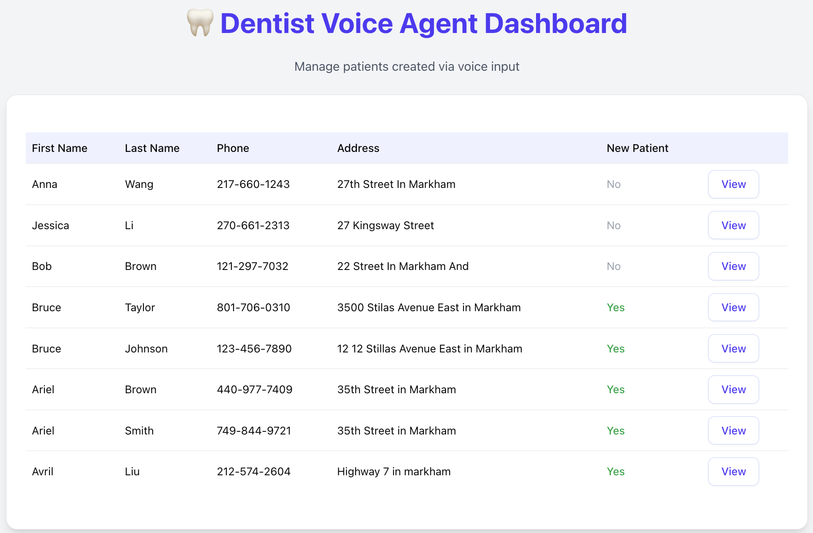

# Dentist Voice Agent

A small, focused **voice-to-patient record** project for a dental clinic.

The tool persists to a **single table** (`patients`) as required, automatically detects **new vs returning** by normalized phone number, renders a **deduplicated list** (latest record per phone), and shows a **visit count** in the detail dialog.

<p align="center">
  
</p>

---

## What’s included

- **Single table only**: `patients(first_name, last_name, phone_number, address, new_patient)`
- **New vs returning** by normalized phone (digits only)
  - first time a phone appears → `new_patient = true`
  - later visits → insert another row with `new_patient = false`
- **Deduped list** in the UI (one row per phone; the most recent one)
- **Visit count** in the dialog (`/patients/{id}/stats`)
- **Voice-agent friendly**: a `/patients/voice` endpoint you can feed from any STT/LLM/TTS pipeline

<p align="center">
  
</p>

---

## Tech

- **Backend**: Spring Boot + MySQL  
- **Frontend**: Next.js (App Router) + shadcn/ui  
- **Voice**: bElevenLabs

---

## Getting started

### Backend

```bash
cd backend
./mvnw spring-boot:run   # or: mvn spring-boot:run
# base URL: http://localhost:8080
```
---

## Endpoints (Backend)

- `GET  /patients`  
  Original endpoint; returns **all** rows (kept for compatibility).

- `POST /patients`  
  Create a row (used by UI/forms).

- `POST /patients/voice`  
  Same as above, intended for **voice intake**.

- `GET  /patients/unique`  
  **Deduped list** — returns the **latest record per normalized phone**.

- `GET  /patients/{id}/stats`  
  Returns visit stats for the selected row:  
  ```json
  { "visit_count": 2, "new_patient_first_time": false }


## Frontend (Next.js + shadcn/ui)

- Tech: Next.js (App Router), shadcn/ui, axios
- Table loads a **deduped** list; dialog fetches per-patient stats on open.

```bash
cd frontend
npm i
npm run dev
# http://localhost:3000
```
## Data model & rules

- One table only: `patients(first_name, last_name, phone_number, address, new_patient)`
- Phone is **normalized (digits-only)** before persistence.
- New vs returning:
  - first time a normalized phone appears → `new_patient = true`
  - otherwise → `new_patient = false`
- UI shows **latest row per phone**; the dialog shows **total visits**.
```
```sql
CREATE TABLE patients (
  id BIGINT PRIMARY KEY AUTO_INCREMENT,
  first_name   VARCHAR(255),
  last_name    VARCHAR(255),
  phone_number VARCHAR(64),  -- stored normalized (digits only)
  address      VARCHAR(512),
  new_patient  BOOLEAN
);
```


## How I implemented it (without breaking existing code)

**Controller**  
- **kept:** `GET /patients`, `POST /patients`, `POST /patients/voice`  
- **added:**  
  - `GET /patients/unique` — returns the deduped list for the table (calls `PatientService.getUniquePatients`)  
  - `GET /patients/{id}/stats` — returns `{ visit_count, new_patient_first_time }` (calls `PatientService.getVisitStats`)  
- *Why:* keep the write paths unchanged and add read-only endpoints so the UI can stay simple and explicit.

**Service**  
- I didn’t touch the existing save logic.  
- **helpers added:**  
  - `getUniquePatients()` — thin wrapper over the repo query that fetches the **latest row per normalized phone**.  
  - `getVisitStats(Long id)` — loads the row by `id`, normalizes its phone once, counts visits via the repo, and sets `new_patient_first_time = (count == 1)`.  
- *Note:* centralizing normalization avoids double-normalizing and formatting drift.

**Repository**  
- **queries added (native SQL):**  
  - `findLatestUnique()` — MySQL 8+ window function using  
    `ROW_NUMBER() OVER (PARTITION BY REGEXP_REPLACE(phone_number,'[^0-9]','') ORDER BY id DESC)`  
    to pick the newest row per phone.  
  - `countVisits(:norm)` — counts rows by the normalized phone.  
- *Why native:* explicit control over partition + ordering so “latest wins” is deterministic.

**Frontend**  
- Left table/dialog markup and styling as-is.  
- **data hooks:**  
  - table → `GET /patients/unique`  
  - dialog (on **View**) → `GET /patients/{id}/stats`, then render **Visits** and **First-time New**  
- *Small UX detail:* clear dialog state on close so stats don’t “stick” between rows.


## Design notes (my approach)

- **Why “log-style” rows:** The prompt limits me to one table. I want both a clean roster and a sense of history, so I record **one row per visit** in the DB and **dedupe at read time** for the table. The dialog then shows the full visit count for context.
- **Identity via phone (normalized):** In this scope, phone is the most practical identifier. I normalize to digits-only so `(270) 661-2313`, `270-661-2313`, and `2706612313` map to the same person.
- **Keep existing routes intact:** I didn’t touch the original write paths. I only added two **read-only** endpoints for the UI (`/patients/unique` and `/patients/{id}/stats`) so the behavior is clear and reversible.
- **Simple, explainable rule:** “If this normalized phone hasn’t appeared before → new patient; otherwise → returning.” If all rows for a phone are removed, the next visit is considered new again—which is consistent with the rule and fine for this exercise.


## Screenshots (placement)

- Place files so the README renders them:
  - `docs/images/dashboard.png`   — table (deduped)
  - `docs/images/visit detail.png`  — detail dialog (Visits + First-time New)

```bash
mkdir -p docs/images
# save two PNGs with the filenames above
git add docs/images
git commit -m "docs: add UI screenshots"
git push

```
## Troubleshooting

- **Deduped list empty** — you might be on an older MySQL; switch the dedupe query to a non–window-function variant (group by sanitized phone, take `MAX(id)`).
- **Counts not updating** — make sure the dialog calls `GET /patients/{id}/stats` each time you click **View**, and clears local state on close.
- **CORS in dev** — if needed, add `@CrossOrigin(origins="*")` on the controller.

## Voice agent (provider-agnostic)

- Pipeline: **STT → parse fields (first/last/phone/address) → POST to `/patients` or `/patients/voice` → optional TTS confirmation**.
- Bring your own vendor (Whisper, Deepgram, ElevenLabs, etc.); the API surface is intentionally neutral.

```bash
# example curl (dialog stats)
curl http://localhost:8080/patients/12/stats
# -> {"visit_count":2,"new_patient_first_time":false}
